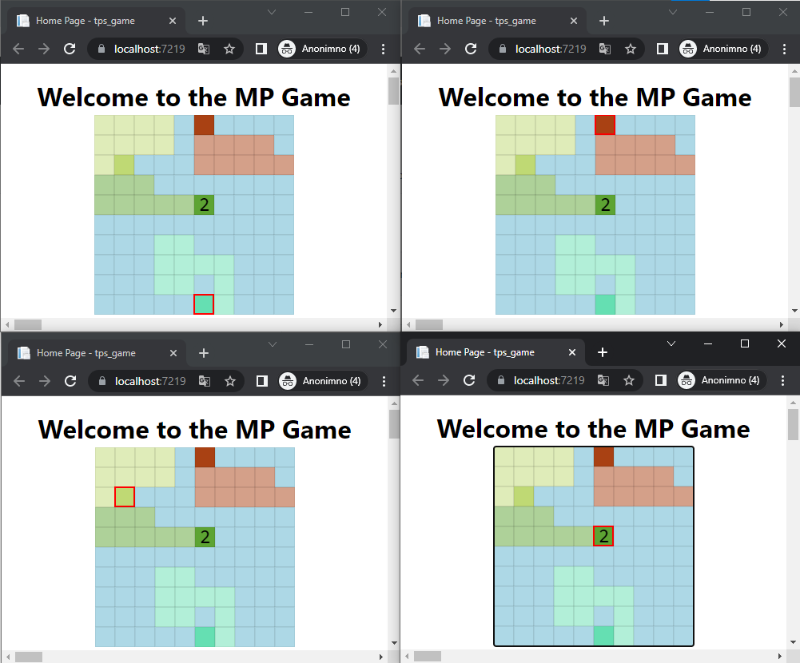

# mp_game
Creating a multiplayer HTML game in ASP .NET using web sockets and SQLite

# Try it out
Until User registration is added, you may login with demo username/password, namely shtef21/shtef21

Territory game: [www.mp-game.com/home/index](http://www.mp-game.com/home/index)

Snake game: [www.mp-game.com/game/snake](http://www.mp-game.com/game/snake)

# Gameplay
https://user-images.githubusercontent.com/72214442/214280219-7e1a9d45-1b8b-4e0c-9dbd-1eb2680ad8e1.mp4

# Image demo
Multiple clients supported

